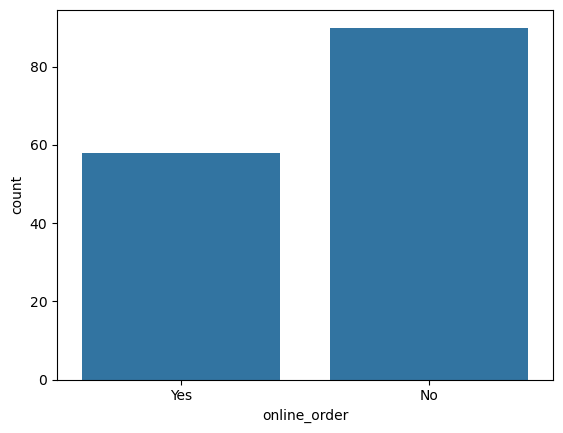
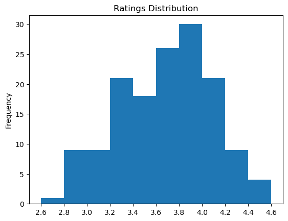
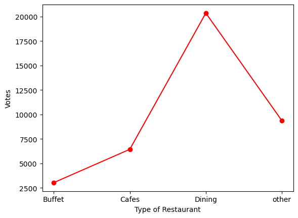
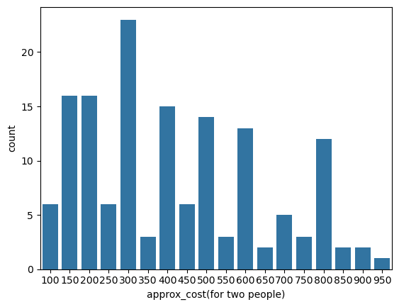

# Zomato Restaurant Data Analytics: Customer Behavior Analysis

Jupyter Notebook : https://github.com/ijaihari/Zomato-Restaurant-Data-Analytics-Customer-Behavior-Analysis/blob/main/Zomato%20Restaurant%20Data%20Analytics%20-%20Customer%20Behavior%20Analysis.ipynb  

**Overview** : In the highly competitive food and hospitality industry, understanding customer behavior and restaurant performance is critical for data-driven decision-making.  

This project analyzes Zomato restaurant data using Python to explore patterns in customer preferences, restaurant categories, pricing ranges, and ordering modes through exploratory data analysis (EDA).

# Tools & Technologies

Python, Pandas, NumPy, Matplotlib, Seaborn, Jupyter Notebook

# Key Analysis Performed

- Data cleaning and preprocessing
- Handling mixed-format rating values
- Exploratory Data Analysis (EDA)
- Trend analysis using visualizations

# Business Questions & Insights

### Do more restaurants offer online delivery or offline services?

**Insight**
- Most restaurants operate with offline (dine-in) services.

### Which types of restaurants are most preferred by customers?

**Insight**
- Dining restaurants are the most prevalent category and receive the highest customer engagement.

### How are restaurant ratings distributed?

**Insight**
- Most restaurants have ratings between 3.5 and 4.0.

### Do online-order restaurants receive better ratings?

**Insight**
- Restaurants offering online orders generally receive higher ratings than offline-only restaurants.

### Which restaurant categories are most preferred by customers?

**Insight**
- Dining and casual restaurant types show the highest customer preference.

### What price range do couples prefer for dining out?

**Insight**
- Couples most commonly prefer restaurants priced around ₹300 for two people.

# Final Conclusion

- Dining restaurants dominate the Zomato platform and receive the highest number of votes.

- A majority of restaurants still rely on offline services, while cafes show stronger online-order adoption.

- Most couples prefer mid-range restaurants (~300 rupees for two), indicating value-conscious dining behavior.

- Restaurants offering online orders tend to receive higher ratings, suggesting better customer experience or convenience.
